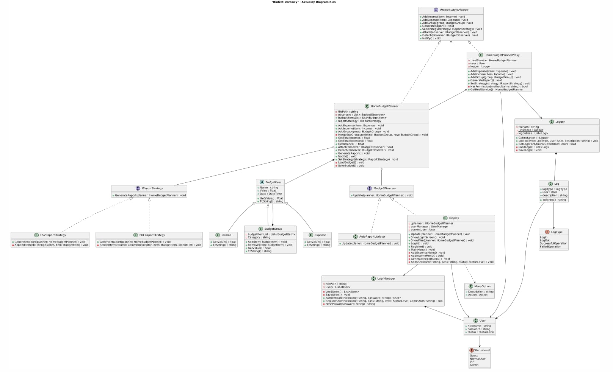
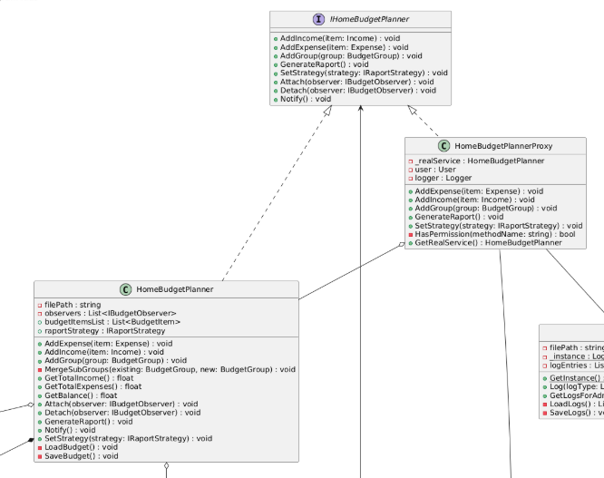
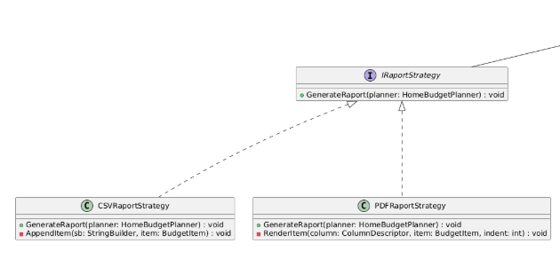
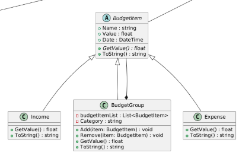
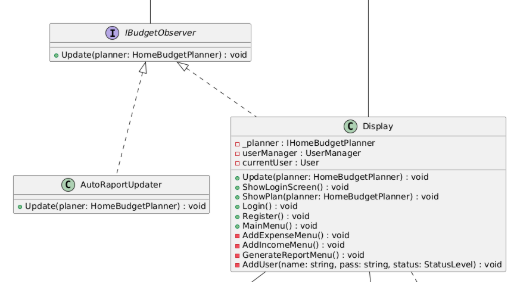

# Home budget planer 

---
**Home budget planer** to stworzona przez nas aplikacja, której głownym zadaniem jest zarządzanie finansami osobistytymi poprzez śledzenie przychodów i wydatków. Dzięki zastosowaniu wzorców projektowych, takich jak Kompozyt czy Strategia, system pozwala na intuicyjne kategoryzowanie kosztów oraz generowanie raportów budżetowych w formatach PDF i CSV. Całość opiera się na trwałym zapisie danych w formacie JSON, co w połączeniu z systemem uprawnień Proxy oraz modułem Loggera zapewnia pełną kontrolę, bezpieczeństwo i przejrzystość historii w sam raz dla domowego budżetu.

---
---
## Diagram klasy
Poniższy diagram przedstawia architekturę systemu wraz z zastosowanymi przez nas wzorcami projektowymi.

---
---
## Opis Zastosowanych Wzorców

### 1. Proxy

**Cel użycia:**  
Kontrola dostępu do metod modyfikujących budżet oraz generujących raporty w zależności od poziomu uprawnień zalogowanego użytkownika dla przykładu `Gość` nie może generować raportów.

**Role:**
- `IHomeBudgetPlanner` – interfejs wspólny
- `HomeBudgetPlanner` – rzeczywisty obiekt
- `HomeBudgetPlannerProxy` – obiekt proxy

**Lokalizacja:**  
`Classes/HomeBudgetPlannerProxy.cs`  
Użycie: inicjalizacja w `Display.cs`

**Wektor zmian:**  
Przy użyciu tego wzorca można by dodać buforowanie do obliczania wyników balansu, jeżeli będzie znacząca ilość wpisów dla budżetu. Dzięki temu program automatycznie poda ostatnią wartość z pamięci - jeżeli nie dodano żadnego wydatku.

---

### 2. Strategy

**Cel użycia:**  
Umożliwienie dynamicznej zmiany formatu wyjściowego raportu do pliku PDF lub CSV w trakcie działania programu.

**Role:**
- `IRaportStrategy` – interfejs strategii
- `PDFRaportStrategy`, `CSVRaportStrategy` – konkretne strategie
- `HomeBudgetPlanner` – miejsce wywołania strategii

**Lokalizacja:**  
`Interfaces/IRaportStrategy.cs` oraz folder `Classes`  
Wywoływane w menu generowania raportu

**Wektor zmian:**  
Łatwe dodanie nowych formatów (np. Excel, XML) poprzez stworzenie nowej klasy implementującej odpowiedni interfejs.

---

### 3. Composite

**Cel użycia:**  
Reprezentacja hierarchicznej struktury wydatków, gdzie kategoria może zawierać zarówno pojedyncze wydatki, jak i inne podkategorie.

**Role:**
- `BudgetItem` – komponent bazowy
- `Expense`, `Income` – elementy liście 
- `BudgetGroup` – kompozyt przechowujący kolekcję `BudgetItem`

**Lokalizacja:**  
`Classes/BudgetItem.cs`  
`Classes/BudgetGroup.cs`

**Wektor zmian:**  
Wzorzec ten idealnie sprawdziłby się, jeżeli naszą aplikację rozszerzylibyśmy o konta i portfele. Majątek całkowity byłby głównym komponentem.

---

### 4. Observer

**Cel użycia:**  
Automatyczne powiadamianie komponentów (interfejsu użytkownika oraz modułu automatycznych raportów) o każdej zmianie w budżecie.

**Role:**
- `IBudgetObserver` – interfejs obserwatora
- `HomeBudgetPlanner` – obiekt obserwowany
- `Display`, `AutoRaportUpdater` – elementy reagujące

**Lokalizacja:**  
`Interfaces/IBudgetObserver.cs`  
Metoda `Notify()` w `HomeBudgetPlanner.cs`

**Wektor zmian:**  
Możliwość dodania modułu powiadomień po przekroczeniu limitu wydatków. Możliwość zrealizowania przy użyciu System.Net.Mail.

---

### 5. Singleton

**Cel użycia:**  
Zapewnienie jednego, globalnego obiektu do logowania zdarzeń systemowych, dostępnego z każdego poziomu aplikacji.

**Role:**
- `Logger` – klasa Singleton

**Lokalizacja:**  
`Classes/Logger.cs`, metoda `GetInstance()`

**Wektor zmian:**  
Możliwość zmiany miejsca zapisu logów na przykład z pliku JSON na bazę danych SQL w jednym punkcie.

---
---
## Rozwiązania Specyficzne i Biblioteki

- **Język:** C# (.NET 8.0)
- **System.Text.Json:**
 Serializacja do plków JSON, umożliwiająca zapis i odczyt różnych typów obiektów  
- **SHA256:**  
  Bezpieczne hashowanie haseł w klasie `UserManager` wykorzystywane przy zapisie do pliku JSON.
- **QuestPDF:**  
  Biblioteka do generowania raportów PDF (`PDFRaportStrategy`)
- **UTF-8:**  
  Poprawny zapis informacji do pliku JSON (obsługa polskich znaków)

---
---
## Podział Pracy w Zespole

| Członek zespołu | Zadania |
|----------------|---------|
| Radosław Janczura | Stworzenie repozytorim, stworzenie szkieletu na podstawie diagramu UML, serializacja do plików JSON, zabiezpieczenie haseł hashowaniem , stworzenie dokumentacji, pomoc przy debugowaniu, pomoc przy implementacji wzorców projektowych, zapewnieniu spójności danych pomiędzy sesjami oraz optymalizacji logiki aplikacji.  |
| Bartosz Orłowski | Stworzenie klasy Display i obsługa menu w konsoli, napisanie logiki dodawania wydatków i przychodów w poprawny sposób, dodanie walidacji, czy użytkownik wpisuje poprawne kwoty. |
| Piotr Burzyński | Implementacja wzorca Strategia, pozwalającego na wybór formatu raportu , stworzenie modułu Obserwatora do reagowania na zmiany w budżecie oraz wykorzystanie biblioteki QuestPDF do generowania plików PDF. |
| Damian Filimoniuk | Implementacja wzorców Singleton, odpowiadającego w projekcie za klasę Loggera oraz wzorca Proxy kontrolującego dostęp, finalne poprawki kodu, dodanie wzorca Composite, możliwość dodawania grup budżetowych. |
---
---
## 5. Instrukcja Użytkownika

### Uruchomienie i logowanie
Po uruchomieniu programu wyświetli się menu główne:
- Przy pomocy klawiszy numerycznych należy wybrać odpowiednią opcję
    - Możliwość wypróbowania jako gość
    - Możliwoć zalogowania się na istniejące konto
    - Możliwość rejestracji nowych kont
    - Wyjście z programu
- Domyślny login i hasło dla administratora: **login:** `admin` **hasło:** `admin`
- Nadanie roli Admin wymaga hasła aktualnego administratora

### Zarządzanie budżetem

- Wybierz opcję **„Dodaj Wydatek”** lub **„Dodaj przychód”**
- Dla **„Dodaj Wydatek”** Podaj:
  - kategorię (np. `Dom`)
  - podkategorię (np. `Jedzenie`)
  - nazwę wydatku
  -  wartość
 - Dla **„Dodaj przychód”** Podaj:
    - nazwę przychodu (np. `wypłata`)
    - wartość
- Stan budżetu dostępny w menu **„Pokaż Budżet”**
- Elementy są automatycznie grupowane
### Raporty i logi

- W menu **„Zapisz raport”** wybierz format:
  - PDF
  - CSV
---
---
## Instrukcja Instalacji

1. Pobierz folder projektu (np. przy użyciu git clone)
2. Otwórz terminal w katalogu `HomeBudgetProject`
4. Uruchom aplikację w konsoli przy użyciu `dotnet run`
5. Aplikacja automatycznie utworzy pliki:
    - users.json
    - budget.json
    - system_logs.json